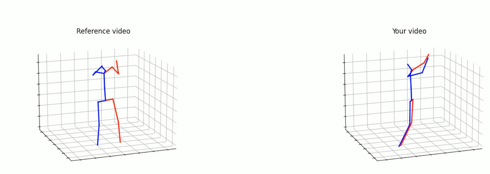

# FormSync

### Team: Ryan Bui, Max Glass, Jeremy Kim, Rachel Li, Nathan Wang, Valary Anguzuzu

Our submission for the Northwestern 2025 IEEE technical program. FormSync won the award for the most technically impressive project.

## About the Project

FormSync is a motion comparison application designed to help users improve their physical movements. It allows users to compare their own video recordings against a reference video, constructing 3D skeletal reconstructions of both. By analyzing joint angles, the application provides a score indicating the accuracy of the user's motion compared to the reference.

## Tech Stack

### Frontend:
For the frontend, we employed the [Astro](https://astro.sh) web framework. The frontend is very minimal and uses a react island component for the interactive video submission form.

### Backend:
The backend is written in python using [Flask](https://flask.palletsprojects.com/en/stable/). The server has an endpoint for submitting a user provided video which returns the loss values for every angle and an endpoint for retrieving the generated skeletal reconstruction video. For the video processing, we use the [YOLO](https://en.wikipedia.org/wiki/You_Only_Look_Once), [HRNet](https://arxiv.org/abs/1908.07919), and [PoseformerV2](https://arxiv.org/abs/2303.17472) models, running all inference on [PyTorch](https://pytorch.org/). The inference has been developed to be PyTorch backend agnostic and can utilize up to 1 GPU at a time, if available on the system. For performing [Dynamic Time Warping](https://en.wikipedia.org/wiki/Dynamic_time_warping), we utilize the [fastdtw](https://pypi.org/project/fastdtw/) Python package.

## How it works:

### Human Detection:
Upon receiving a video, the backend first runs every frame through YOLO, to find the most prominent human in the frame and outputs a bounding box for the person.

### Joint Detection:
Once we have identified where the subject is in each frame, we pass the part of the video encompassed by the bounding box to HRNet, which performs inference on the location of the 17 key joints in 2D space.

### 3D Uplifting:
With the 2D location of every joint in every frame, we pass the data to PoseformerV2 which utilizes a Discrete Cosine Transformation and a series of frame-local self-attention heads to infer the third dimension for every joint.

### Frame Alignment:
With the 3D joint data for every frame for the reference video and the user submitted video, we utilize dynamic time warping to do a best-effort frame alignment, avoiding issues of varying speeds of action and video framerates. The distance function is explained in the next section.

### Distance Metric:
The distance metric used for both scoring and frame alignment is the mean absolute error(MAE) of the sum of the angle differences for all identified angles between joints.
